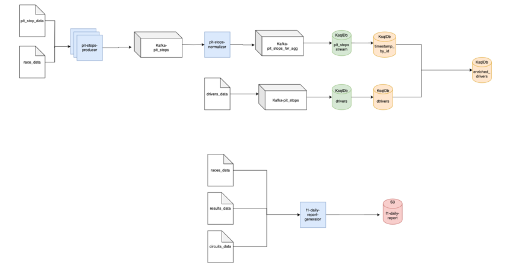

# f1-exercise
This is my local solution.
here is a flow chart to describe the flow:
1. is implemented in python_code/pit-stops-producer
2. is implemented in python_code/spark/pit-stops-normalizer (dedup) + python_code/setup/config/DDL.sql (I used ksqldb for RT enrichment)
3. is implemented in python_code/spark/f1-daily-report-generator
* for the offline report I used local files system which will be replaced with S3 in production 
